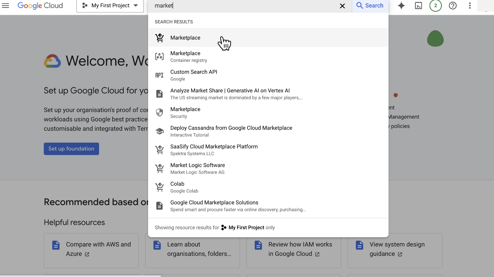
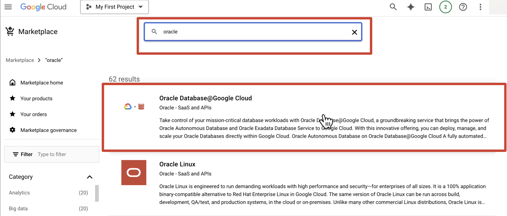
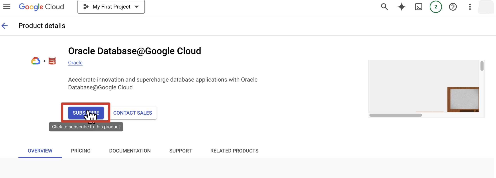
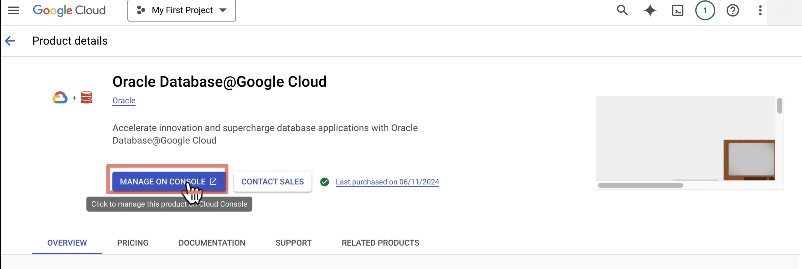
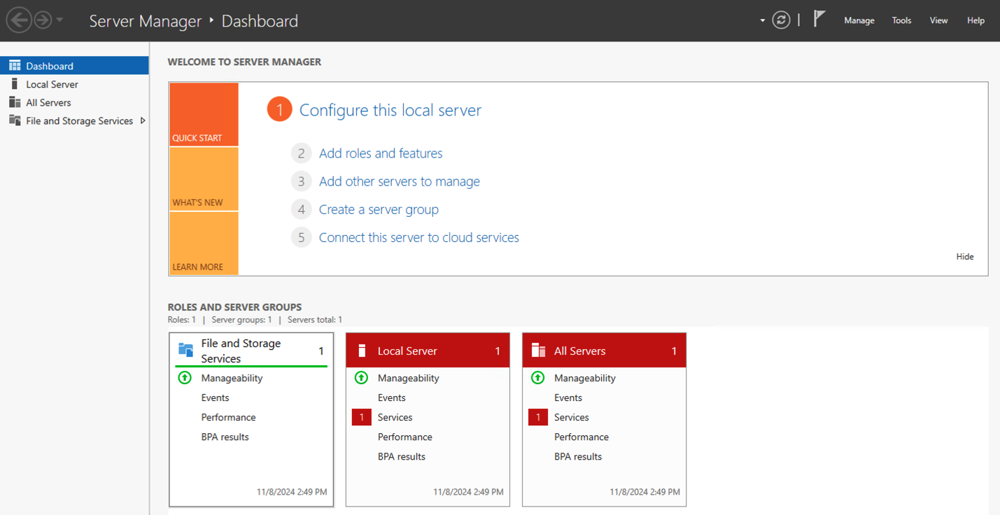
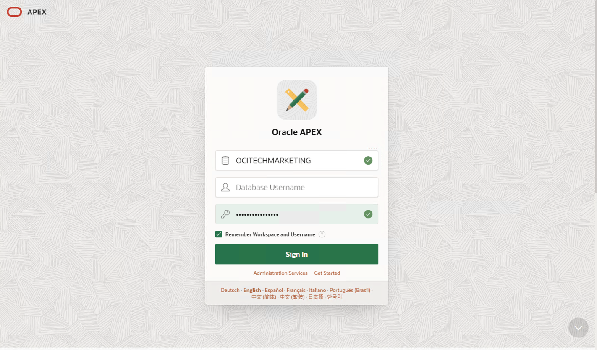
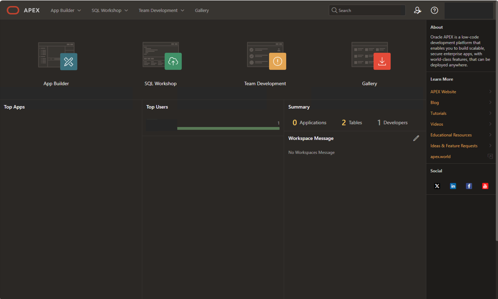

# Subscribe and deploy Oracle Database 23ai on Google Cloud Platform

In this comprehensive guide, we'll walk you through the process of deploying an Autonomous Database on GCP, covering the prerequisites, subscription, deployment, and connection steps.

**TLDR: ** With this guide, you'll learn how to:

Deploy an Autonomous Database on GCP using Terraform
Subscribe to Oracle Autonomous Database on GCP
Connect to the database using SQLCL and APEX UI
Perform various operations, such as creating tables, inserting data, and querying JSON data

## Prerequisites

Before we begin, make sure you have the following prerequisites:

- A GCP account with the necessary permissions to create resources
- The gcloud command-line tool installed and configured on your system
- Oracle Autonomous Database at Google Cloud Platform(GCP) marketplace image

## How to

### Subscribe to Oracle Autonomous Database on GCP  

The first step in deploying an Oracle Autonomous Database on GCP is to subscribe to Oracle Database@Google Cloud image.

- Click search bar and type  `marketplace`
 

- In search bar type `oracle`
  

- Click on `subscribe`
  

- Once Image is activated click on `Manage on OCI`
  

- Connect Marketplace offer with an Oracle Account and click on `Create Account`
  

Once your account is approved you can deploy Oracle Autonomous Database on GCP.  

### Deploy Oracle Autonomous Database on GCP - terraform

Follow this guide on how to [deploy infrastructure with Terraform](/examples/adbs-minimal/README.md)  

### Connect to Oracle Database@Google Cloud

#### Connect to Oracle Database@Google Cloud via sqlcl running

- SSH to your VM

- Download and install [Oracle Instant Client](https://www.oracle.com/uk/database/technologies/instant-client/linux-x86-64-downloads.html)

```bash
wget https://download.oracle.com/otn_software/linux/instantclient/instantclient-basic-linux.x64-23.4.0.24.05.zip
sudo apt install zip
unzip instantclient-basic-linux.x64-23.4.0.24.05.zip
```

- Set the following environment variables to point to the extracted directory:

```bash
export ORACLE_HOME=/path/to/instantclient_23_4
export LD_LIBRARY_PATH=$ORACLE_HOME:$LD_LIBRARY_PATH
export PATH=$ORACLE_HOME:$PATH
```

Replace `/path/to/instantclient_23_4` with the actual path where you extracted the archive.

```bash
mkdir Wallet
```

- Upload your wallet to the VM

  

- Unzip wallet by running

```bash
unzip </path/to/Wallet.zip>.zip
```

- Export path to your wallet to TNS_ADMIN  

```bash
export TNS_ADMIN=</path/to/Wallet>
```

Replace `</path/to/Wallet>` with the actual path where you extracted wallet zip.

- Install required packages

```bash
sudo apt-get install default-jdk libaio1 libaio-dev
```

- Download SQLCL - [here is official download page for SQLCL](https://www.oracle.com/database/sqldeveloper/technologies/sqlcl/download/)-

```bash
wget https://download.oracle.com/otn_software/java/sqldeveloper/sqlcl-latest.zip
```

- Unzip SQLCL

```bash
unzip sqlcl-24.3.0.285.0530.zip 
```

- Run SQLCL to connect to the Oracle Autonomous Database

```bash
./sqlcl/bin/sql admin/password@tnsname_medium
```

  

#### (Optional) few commands to warm up your SQL powers

```sql
-- Create a table with a JSON column
CREATE TABLE mytable (
    id NUMBER PRIMARY KEY,
    data VARCHAR2(4000) CHECK (data IS JSON)
);

-- Insert some sample data
INSERT INTO mytable (id, data) VALUES (1, '{"name":"John", "age":30}');
INSERT INTO mytable (id, data) VALUES (2, '{"name":"Jane", "age":25}');

-- Query the JSON data using SQL/JSON functions
SELECT * FROM mytable WHERE JSON_VALUE(data, '$.name') = 'John';

-- Update the JSON data using JSON_OBJECT function
UPDATE mytable 
SET data = JSON_OBJECT('name' VALUE JSON_VALUE(data, '$.name'), 'age' VALUE 31) 
WHERE JSON_VALUE(data, '$.name') = 'John';
```

**Example 1:** Retrieve all rows where age is greater than 25

```sql
SELECT *
FROM mytable
WHERE JSON_VALUE(data, '$.age') > 25;
```

This query uses the JSON_VALUE function to extract the value of the age property from the data column and filters the results to include only rows where the age is greater than 25.

**Example 2:** Retrieve the average age of all users

```sql
SELECT AVG(JSON_VALUE(data, '$.age')) AS avg_age
FROM mytable;
```

This query uses the AVG aggregation function to calculate the average age of all users.

**Example 3:** Retrieve the names of all users who are older than 30

```sql
SELECT JSON_VALUE(data, '$.name') AS name
FROM mytable
WHERE JSON_VALUE(data, '$.age') > 30;
```

This query extracts the value of the name property from the data column and filters the results to include only rows where the age is greater than 30.

**Example 4:** Retrieve the count of users grouped by age range

```sql
SELECT 
  CASE 
    WHEN JSON_VALUE(data, '$.age') BETWEEN 20 AND 29 THEN '20-29'
    WHEN JSON_VALUE(data, '$.age') BETWEEN 30 AND 39 THEN '30-39'
    ELSE '40+'
  END AS age_range,
  COUNT(*) AS count
FROM mytable
GROUP BY 
  CASE 
    WHEN JSON_VALUE(data, '$.age') BETWEEN 20 AND 29 THEN '20-29'
    WHEN JSON_VALUE(data, '$.age') BETWEEN 30 AND 39 THEN '30-39'
    ELSE '40+'
  END;
```

#### (Optional) Connect to Oracle Database@Google Cloud APEX UI via Windows VM

- In `Compute Engine` section under `VM instances` you can access Windows VM.

  

- Click on `RDP` to download remote desktop file.  

- Open remote desktop file and login with your windows password.  

  

- Once logged in open browser on your remote `Windows VM` and navigate to Private endpoint URL

  

Then choose Oracle APEX

  

- Login with your admin password and create new `workspace`.

  

- Login to your `workspace`.

  

  

## Conclusion

In conclusion, deploying an Autonomous Database on GCP involves several steps, including creating a VPC, subnets, firewall rules, a bastion host or Windows VM, and configuring instaclient and sqlcl.

You may proceed to the next step [RAG Chatbot engine with Oracle Database 23ai on Google Cloud](README_RAG.md)