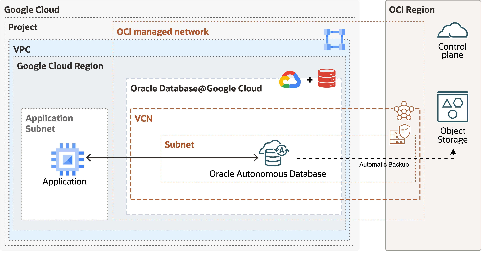

# gcp-oci-adbs-quickstart
This is a quick-start template for provision an Autonomous Database @ Google Cloud with a VPC in a given existing project.

## Architecture


## Example
[](https://shell.cloud.google.com/cloudshell/editor?cloudshell_git_repo=https%3A%2F%2Fgithub.com%2Foracle-quickstart%2Fterraform-oci-multicloud-gcp&cloudshell_git_branch=adbs-ai&cloudshell_open_in_editor=main.tf&cloudshell_workspace=.%2Fexamples%2Fadbs-minimal&cloudshell_tutorial=..%2F..%2Fdocs%2Ftutorials%2Fadbs-terraform%2FREADME.md)

```tf
module "gcp-oci-adbs-quickstart" {
  # source = "github.com/oracle-quickstart/terraform-oci-multicloud-gcp//templates/gcp-oci-adbs-quickstart"
  source = "../../templates/gcp-oci-adbs-quickstart"
  project = "example"
  location = "europe-west2"  
  network_name = "example-vpc"
  cidr = "10.1.0.0/24"
  customer_email = "your_email@here"
  admin_password = "DoNotKeepThis$1234"
}

output "adbs_ocid" {
  description = "OCID of this Autonomous Database @ Google Cloud"
  value = module.gcp-oci-adbs-quickstart.oci_adbs_ocid
}
```

<!-- BEGIN_TF_DOCS -->
## Requirements

| Name | Version |
|------|---------|
| <a name="requirement_terraform"></a> [terraform](#requirement\_terraform) | ~> 1.9.2 |
| <a name="requirement_google"></a> [google](#requirement\_google) | >= 6.8.0 |
| <a name="requirement_local"></a> [local](#requirement\_local) | >= 2.5.1 |
| <a name="requirement_random"></a> [random](#requirement\_random) | >= 3.5 |

## Providers

| Name | Version |
|------|---------|
| <a name="provider_random"></a> [random](#provider\_random) | 3.6.3 |

## Modules

| Name | Source | Version |
|------|--------|---------|
| <a name="module_google_ora_adbs"></a> [google\_ora\_adbs](#module\_google\_ora\_adbs) | ../../modules/gcp-ora-adbs | n/a |
| <a name="module_network"></a> [network](#module\_network) | terraform-google-modules/network/google//modules/vpc | 10.0.0 |

## Resources

| Name | Type |
|------|------|
| [random_password.admin_password](https://registry.terraform.io/providers/hashicorp/random/latest/docs/resources/password) | resource |
| [random_string.suffix](https://registry.terraform.io/providers/hashicorp/random/latest/docs/resources/string) | resource |

## Inputs

| Name | Description | Type | Default | Required |
|------|-------------|------|---------|:--------:|
| <a name="input_adb_name"></a> [adb\_name](#input\_adb\_name) | The name (prefix) which should be used for this Autonomous Database. | `string` | `"oraadbs"` | no |
| <a name="input_admin_password"></a> [admin\_password](#input\_admin\_password) | The password for the default ADMIN user | `string` | n/a | yes |
| <a name="input_backup_retention_period_days"></a> [backup\_retention\_period\_days](#input\_backup\_retention\_period\_days) | The retention period for the Autonomous Database. This field is specified in days, can range from 1 day to 60 days, and has a default value of 60 days. | `number` | `60` | no |
| <a name="input_character_set"></a> [character\_set](#input\_character\_set) | The character set for the Autonomous Database. The default is AL32UTF8. | `string` | `"AL32UTF8"` | no |
| <a name="input_cidr"></a> [cidr](#input\_cidr) | The subnet CIDR range for the Autonmous Database | `string` | n/a | yes |
| <a name="input_compute_count"></a> [compute\_count](#input\_compute\_count) | The number of compute servers for the Autonomous Database. | `number` | `2` | no |
| <a name="input_customer_email"></a> [customer\_email](#input\_customer\_email) | The email address used by Oracle to send notifications regarding databases and infrastructure. | `string` | n/a | yes |
| <a name="input_data_storage_size_tb"></a> [data\_storage\_size\_tb](#input\_data\_storage\_size\_tb) | The size of the data stored in the database, in terabytes. | `number` | `1` | no |
| <a name="input_db_edition"></a> [db\_edition](#input\_db\_edition) | The edition of the Autonomous Databases. Possible values: DATABASE\_EDITION\_UNSPECIFIED STANDARD\_EDITION ENTERPRISE\_EDITION | `string` | `""` | no |
| <a name="input_db_version"></a> [db\_version](#input\_db\_version) | The Oracle Database version for the Autonomous Database. | `string` | `"23ai"` | no |
| <a name="input_db_workload"></a> [db\_workload](#input\_db\_workload) | Possible values: DB\_WORKLOAD\_UNSPECIFIED OLTP DW AJD APEX | `string` | `"OLTP"` | no |
| <a name="input_deletion_protection"></a> [deletion\_protection](#input\_deletion\_protection) | Whether or not to allow Terraform to destroy the instance. Unless this field is set to false in Terraform state, a terraform destroy or terraform apply that would delete the instance will fail. | `bool` | `true` | no |
| <a name="input_display_name"></a> [display\_name](#input\_display\_name) | The display name for the Autonomous Database. The name does not have to be unique within your project. | `string` | `""` | no |
| <a name="input_is_auto_scaling_enabled"></a> [is\_auto\_scaling\_enabled](#input\_is\_auto\_scaling\_enabled) | This field indicates if auto scaling is enabled for the Autonomous Database CPU core count. | `bool` | `true` | no |
| <a name="input_is_storage_auto_scaling_enabled"></a> [is\_storage\_auto\_scaling\_enabled](#input\_is\_storage\_auto\_scaling\_enabled) | This field indicates if auto scaling is enabled for the Autonomous Database storage. | `bool` | `false` | no |
| <a name="input_labels"></a> [labels](#input\_labels) | The labels or tags associated with the Autonomous Database. | `map(string)` | <pre>{<br/>  "createdby": "gcp-ora-adbs"<br/>}</pre> | no |
| <a name="input_license_type"></a> [license\_type](#input\_license\_type) | The license type used for the Autonomous Database. Possible values: LICENSE\_TYPE\_UNSPECIFIED LICENSE\_INCLUDED BRING\_YOUR\_OWN\_LICENSE | `string` | `"LICENSE_INCLUDED"` | no |
| <a name="input_location"></a> [location](#input\_location) | GCP region where Autonmous Database is hosted. | `string` | n/a | yes |
| <a name="input_maintenance_schedule_type"></a> [maintenance\_schedule\_type](#input\_maintenance\_schedule\_type) | The maintenance schedule of the Autonomous Database. Possible values: MAINTENANCE\_SCHEDULE\_TYPE\_UNSPECIFIED EARLY REGULAR | `string` | `"REGULAR"` | no |
| <a name="input_mtls_connection_required"></a> [mtls\_connection\_required](#input\_mtls\_connection\_required) | This field specifies if the Autonomous Database requires mTLS connections. | `bool` | `false` | no |
| <a name="input_n_character_set"></a> [n\_character\_set](#input\_n\_character\_set) | The national character set for the Autonomous Database. The default is AL16UTF16. | `string` | `"AL16UTF16"` | no |
| <a name="input_network_name"></a> [network\_name](#input\_network\_name) | The name of the VPC network used by the Autonomous Database | `string` | n/a | yes |
| <a name="input_operations_insights_state"></a> [operations\_insights\_state](#input\_operations\_insights\_state) | Possible values: OPERATIONS\_INSIGHTS\_STATE\_UNSPECIFIED ENABLING ENABLED DISABLING NOT\_ENABLED FAILED\_ENABLING FAILED\_DISABLING | `string` | `"NOT_ENABLED"` | no |
| <a name="input_private_endpoint_ip"></a> [private\_endpoint\_ip](#input\_private\_endpoint\_ip) | The private endpoint IP address for the Autonomous Database. | `string` | `""` | no |
| <a name="input_private_endpoint_label"></a> [private\_endpoint\_label](#input\_private\_endpoint\_label) | The private endpoint label for the Autonomous Database. | `string` | `""` | no |
| <a name="input_project"></a> [project](#input\_project) | The ID of the project in which the resource belongs. If it is not provided, the provider project is used. | `string` | n/a | yes |
| <a name="input_random_suffix_length"></a> [random\_suffix\_length](#input\_random\_suffix\_length) | n/a | `number` | `3` | no |

## Outputs

| Name | Description |
|------|-------------|
| <a name="output_autonomous_database_id"></a> [autonomous\_database\_id](#output\_autonomous\_database\_id) | The ID of the AutonomousDatabase in Google Cloud. |
| <a name="output_location"></a> [location](#output\_location) | The location of the resource in Google Cloud. |
| <a name="output_oci_adbs_ocid"></a> [oci\_adbs\_ocid](#output\_oci\_adbs\_ocid) | OCID of Autonomous Database in OCI |
| <a name="output_oci_compartment_ocid"></a> [oci\_compartment\_ocid](#output\_oci\_compartment\_ocid) | Compartment OCID of the Autonomous Database in OCI |
| <a name="output_oci_region"></a> [oci\_region](#output\_oci\_region) | Region of the Autonomous Database in OCI |
| <a name="output_oci_tenant"></a> [oci\_tenant](#output\_oci\_tenant) | The OCI tenant of the Autonomous Database |
| <a name="output_project"></a> [project](#output\_project) | The Project of the AutonomousDatabase in Google Cloud. |
| <a name="output_resource_id"></a> [resource\_id](#output\_resource\_id) | Resource Identifier of Autonomous Database in Google Cloud |
<!-- END_TF_DOCS -->